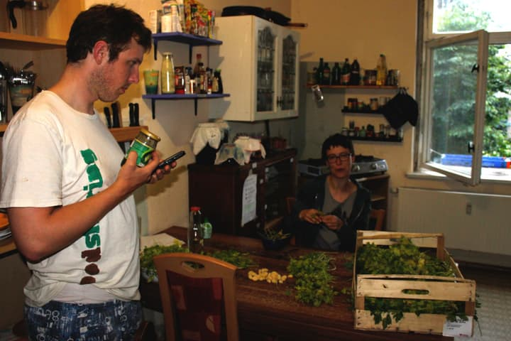
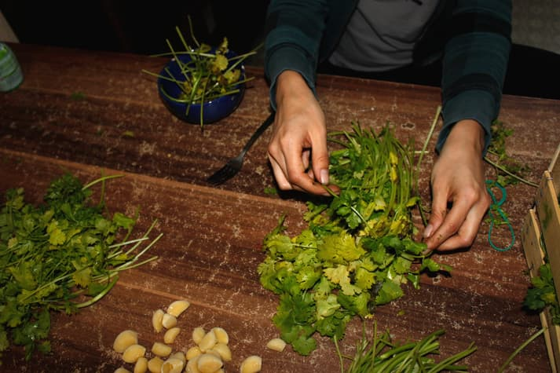
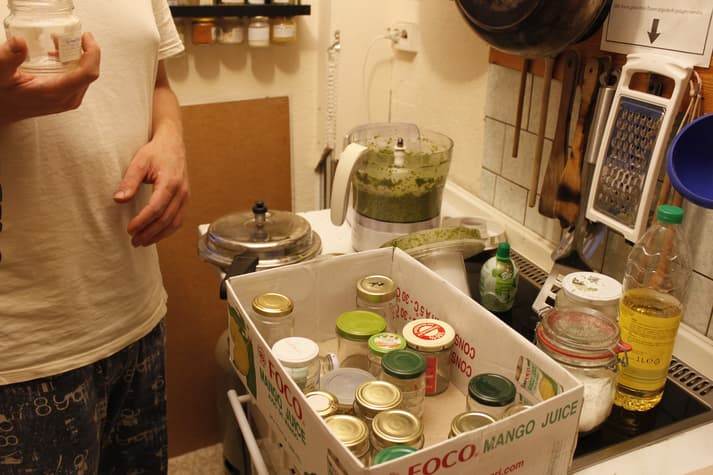

Es ist Sommer! :D

Die Sonne ist da, es ist schön warm draußen und die Leute fahren in den Urlaub. Das ist toll, aber auch der Grund für viele Kopfschmerzen von Betriebsverantwortlichen größerer Lebensmittelretter-Gruppen. Sie fürchten nicht genügend Abholer zu finden, um regelmäßg alle Kooperationsbetriebe zu besuchen...

===

Genauso geht es [foodsharing Leipzig](https://foodsharing.de/?page=fairteiler&bid=23). Als ich also einen Hilferuf auf [foodsharing.de](https://foodsharing.de) las, entschloss ich bei einer Abholung nicht weit vom Hauptbahnhof entfernt zu helfen. Es war ein Markt und wir haben insgesamt ca. 10 Kisten voller Obst, Gemüse und Kräuter gerettet. Ich selbst habe ungefähr 10 kg Spargel, 8 Brokkolis, 1 kg Paprika, einige Kiwis, Karotten, Rübchen und einen kleinen Berg an Koriander und Petersilie mitgenommen. Und insgesamt waren wir 7 Abholer...

Auf dem Weg zurück zum Bahnhof konnte ich schon einen Punker mit 3 Paprikas erfreuen, der mir auch versicherte sie zu essen und sie nicht für irgendeinen Unfug zu verwenden. Den ganzen Rest habe ich mit nach Hause genommen.

Wenn man mit solchen Mengen zuhause ankommt, muss man sich ganz fix Möglichkeiten überlegen all das Essen zu verwerten, bevor es doch noch verdirbt. Der erste Schritt ist also festzulegen, was am schnellsten weg muss. In diesem Fall war das der Spargel, der Brokkoli und die Kräuter. Einige der Gerichte, die wir zubereiteten waren:
- Spargelbratlinge
- gedämpfter Spargel und Brokkoli
- Semmelknödel mit Petersilie
- Petersilien-Pesto
- Koriander-Pesto

Lasst mich euch nun ein bisschen mehr über das Koriander-Pesto erzählen. :)

Erst ein paar Tage zuvor hatten wir ein Glas pakistanisches Koriander-Chutney gerettet und das war _umwerfend_! Jetzt also selbst Koriander-Pesto zu machen war nicht nur naheliegend, sondern auch aufregend für uns.

  
_Tilmann sucht Rezepte raus, während Janina schonmal anfängt den Koriander zu sortieren._

  
_Das Sortieren ist wichtig. Sonst können verdorbene Blättchen das ganze gute Pesto verderben!_

In Pestos werden Kräuter mit Fett, Salz und Gewürzen kombiniert, um sie einerseits haltbarer zu machen, und um andererseits eine super intensive, aromatische Paste zu bekommen. Wir haben uns entschieden viel Knoblauch, Rapsöl, Salz und Walnüsse zum Koriander zu geben. Vor allem, weil wir das sowieso noch rumliegen hatten... ;)

All die Zutaten wurden zusammen in den Mixer gegeben und püriert, bis die Masse schön cremig wurde. In der Zwischenzeit schauten wir schonmal nach ein paar Gläsern mit passenden Deckeln, um das fertige Pesto darin abfüllen zu können. Wir sammeln schon seit einiger Zeit Gläser für genau solche Aktionen und fanden sehr schnell einige im Schrank. Weil Pesto so intensiv ist und verschlossene Gläser sich länger halten, entschieden wir uns für kleine Exemplare.

  
_Ein paar Gläser für Hausgemachtes haben wir immer parat._

Der kleine Berg Koriander wurde zu einem Mixerbecher voller Pesto. Wir füllten fünf kleine Gläser damit und stellten sie in den Kühlschrank. Das Pesto wird nun vorraussichtlich zwei Wochen lang halten - das ist zumindest unsere Schätzung. Wenn wir alles aufgegessen haben, bevor die zwei Wochen um sind, um so besser! ;)

  
_Fertig! :)_
