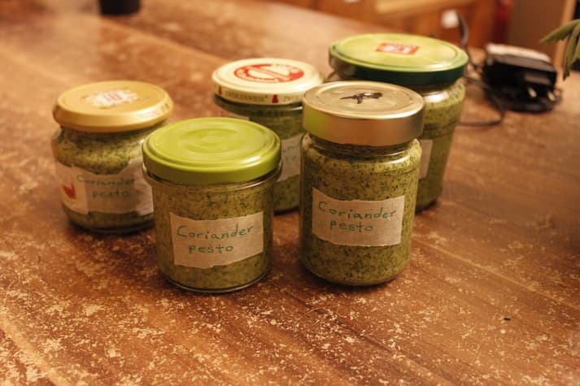

It's summer! :D

The sun is out, it's nice and warm outside and people go on holiday. That's great, but also the reason for a lot of store coordinators of bigger foodsaving groups to worry about not finding enough people to reliably carry out pickups...

That so happens for [foodsharing Leipzig](https://foodsharing.de/?page=fairteiler&bid=23) as well. So when I heard a cry for support I decided to go to Leipzig to help with a pickup not far from the main station. It was an outside market and we were able to save approximately 10 crates of veggies, fruits and herbs. I alone took 10kg of asparagus, 8 broccolis, 1kg of peppers, some kiwis, carrots, turnips and a crazy amount of coriander and parsley - and we were 7 people.

I successfully handed out three peppers to a punk who assured me that he'd eat them and not throw them at somebody or something similar, but the rest I brought home.

Arriving home with amounts like that, the most pressing thing to do is to find ways to make use of all the food before it gets bad. So the first step is deciding what needs to go first. In this case it was the herbs, the asparagus and the broccoli. Some of the things we did are:
- asparagus fritters
- steamed asparagus and broccoli
- dumplings from old bread with parsley
- parsley pesto
- coriander pesto

Now let me tell you a bit more about the coriander pesto. :)

We had saved a jar of Pakistani coriander chutney just some days earlier and we _loved_ it! So making coriander pesto was something exciting and logical to us.

  
_Tilmann researches a recipe while Janina starts sorting out the coriander._

  
_Sorting the herbs is important. You don't want to have slimy bits spoil the nice pesto!_

The main thing about pesto is that herbs are combined with fats, salt and spices to make them last a little longer and to end up having an awesomely intense paste full of flavor. We decided to put a lot of garlic, rapeseed oil, salt and walnuts to the coriander - mostly because we had it lying around anyway... ;)

It was all together put in the blender and blended until it was nice and smooth. In the meantime we already looked for some clean jars with fitting lids to put the pesto in as soon as it was ready. We collect jars for this and similar purposes since a long time, so it was easy to find some in the closet. Since pesto is quite intense and closed jars last longer, we decided to use small jars.

  
_We always have some jars available for new homemade products._

The huge pile of coriander became one blender full of pesto in the end. We filled it into 5 small jars and put them into the fridge. The pesto will now last for 2 weeks - at least that's our estimation. And if we just finish all of it before those 2 weeks are over, even better! ;)

  
_Done. :)_
