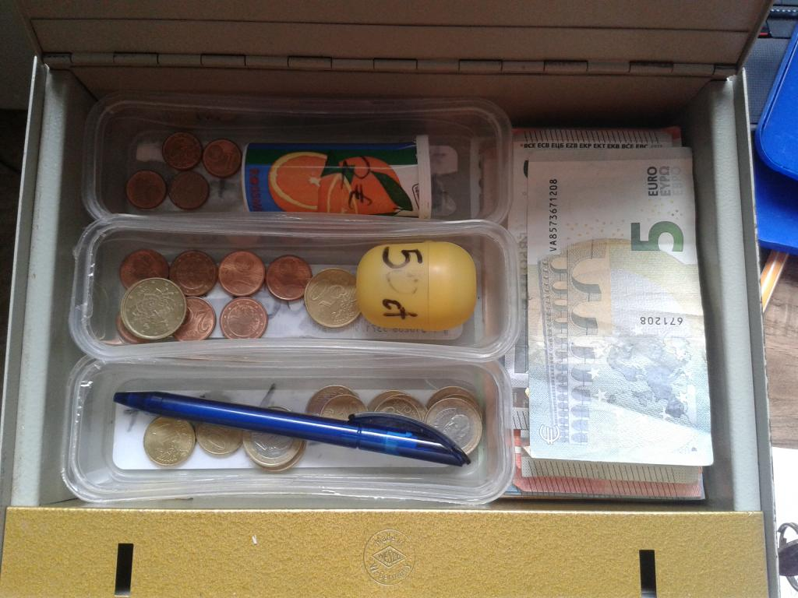
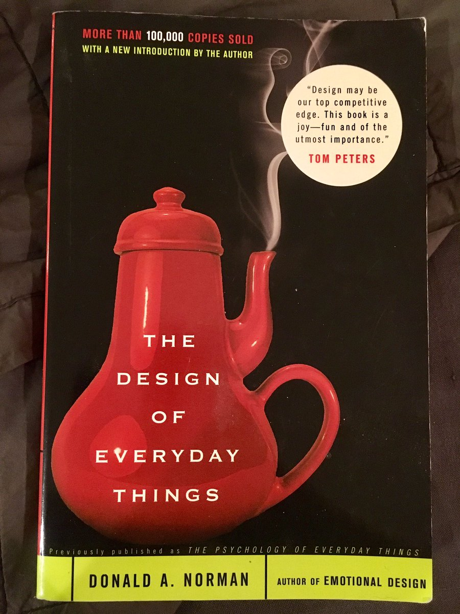

### Eine Fallstudie zur Relevanz von Vereinfachung

**In Kürze:** Ich habe eine Geldbox umdesigned, um sie einfacher handhabbar zu machen. Systeme einfach zu gestalten ist wichtig, wenn du willst, dass andere Menschen sie auf die Art benutzen, die du beabsichtigst.

===

Heute war ich in der Situation Geld aus der Kanthaus-Spendendose (unsortiertes Bargeld) in unsere Geldkassette (sortiertes Bargeld) zu transferieren. Vorher hatte ich immer nur Banknoten hinzugefügt, doch heute gab es auch drei Münzen: je einmal 50 Cent, 10 Cent und 1 Cent. Die Münzen korrekt einzusortieren war garnicht so einfach. Die Kassette sah nämlich so aus:

Die Münzen waren in drei Fächer eingeteilt, die jeweils für mehrere Arten von Münzen gedacht waren (einmal 1€ und 10 Cent, einmal 50 Cent und 2 Cent und einmal 20 Cent und 1 Cent) und zwei Extra-Döschen (eins für 2€ und ein anderes für 5 Cent). In jedem Fach war der Boden mit den jeweils erwarteten Münzwerten beschriftet. Wenn man das so beschreibt, klingt es nicht so schlecht, aber praktisch betrachtet war dieses System ziemlich umständlich:

- Die Beschriftungen an den Böden der Fächer ist von Münzen überdeckt, und da man sie so nicht lesen kann, wirkt die Verteilung der Münzen zufällig.
- Selbst wenn man die Logik erkennt, scheint sie keinem Muster zu folgen, was bedeutet, dass man sich den richtigen Ort für jede Münzart einzeln merken muss.
- Die 2€ und 5 Cent Münzen sind in blickdichten Döschen, sodass es zwei verschiedene Arten der Sortierungshinweise gibt, die verarbeitet werden müssen, um herauszufinden wo eine Münze hingehört (das Aussehen der Münzen vs. Beschriftung der Döschen).
- Die Döschen für die 2€ und 5 Cent Münzen müssen geöffnet werden, um Münzen zu entnehmen oder hinzuzufügen, was bedeutet, dass zwei verschiedene Typen von Aktion nötig sind, um Münzen zu plazieren (ins Fach fallen lassen vs. Döschen öffnen und Münze hineinlegen).
- Es gibt nicht genug Platz, um größere Scheine zu bewegen, sodass die Münzfächer vorher immer herausgenommen werden müssen.

Der Grund, aus dem benutzerunfreundliche Systeme ein Problem darstellen, wird klar, wenn man sich die Möglichkeiten vergegenwärtigt, die ich nun hatte:

1. **Das System lernen** und all die momentane Komplexität verinnerlichen. Das kostet nicht nur meine Zeit, sondern auch die, die zufünftige Benutzer investieren müssen.
1. **Das System brechen** und die Münzen einfach unsortiert in die Kassette werfen. Das verschwendet die bereits von Einigen fürs Lernen des Systems aufgebrachte Zeit.
1. **Das System meiden** und aufgeben zu versuchen die Münzen einzusortieren. Das konzentriert die Arbeitslast und -kompetenz auf weniger Schultern.
1. **Das System neu designen** und es intuitiver machen - für neue sowie alte Nutzer.

Ich hab mich für Letzteres entschieden:

Zuerst schnitt ich die überflüssigen Ränder der Plastikfächer ab, dann fügte ich kleine Trenner aus Pappe hinzu und schrieb den jeweils erwarteten Münzwert auf die Böden der Fächer. Das war jetzt nicht sonderlich innovativ, hat aber sofort die [kognitive Belastung](https://de.wikipedia.org/wiki/Cognitive_Load_Theory) reduziert, der Benutzer beim Lernen und Ausführen dieser simplen Routine ausgesetzt sind: Ein neuer Nutzer muss nun Münzen nur noch nach deren Aussehen identifizieren (eine Art von Hinweis) und sie in das passende Fach legen (eine Art von Aktion). Die Sortierung der Münzen folgt nun dem Schema größter bis kleinster Wert von oben links bis unten rechts, was bedeutet, dass die richtigen Fächer für jeden Münzwert nicht mehr einzeln abgespeichert werden müssen, sondern einer internen Logik folgen. Die Ränder der Plastikfächer abzuschneiden hat für soviel Extraplatz gesogrt, dass nun alle Scheine hineingelegt und entnommen werden können, ohne die Fächer herausnehmen zu müssen.

Die Herausforderung für Designer, sich ihr Werk mit den Augen ihrer potenziellen Nutzer anzusehen, wurde mir erst so richtig klar, als ich Don Norman's Buch, [‘The Design of Everyday Things’](http://www.nixdell.com/classes/HCI-and-Design-Spring-2017/The-Design-of-Everyday-Things-Revised-and-Expanded-Edition.pdf) las. Es hat mich erkennen lassen, wie unglaublich fehleranfällig und geistig limitiert Menschen sind! Die Belastung, die es darstellt, etwas neues zu lernen, steigt mit jedem Ablauf, den ein Mensch verinnerlicht, und leider sind Dsigner oftmals nicht in der Lage die Komplexität ihrer eigenen Kreationen zu sehen. Selbst hochgradig verschachtelte Systeme können für ihren Schöpfer komplett logisch erscheinen.

Und jetzt denk nochmal an die Optionen, die ich vorhin hatte: Lernen, brechen, meiden oder neu designen. Im besten Fall gestaltet jemand ein gutes System, das einfach zu lernen ist und jeder benutzt es einfach. Wenn das nicht gegeben ist, ist der nächstbeste Fall, dass jemand kommt und es neu designed. Neudesign ist allerdings Arbeit, die die meisten Leute nicht machen würden, was dazu führt, dass ein überwältigter neuer Nutzer nur noch die realistischen Möglichkeiten hat das System zu brechen oder zu meiden - beide diese Optionen sind problematisch für andere Nutzer (was den ursprünglichen Designer vielleicht mit einschließt).

Fröhliches Designen und [Testen](https://de.wikipedia.org/wiki/Usability-Test)!

_Der Englische Originalartikel wurde zuerst auf [Doug's persönlichem Blog](https://douginamug.gitlab.io/posts/2018-06-19_cashboxdesign/) veröffentlicht._
