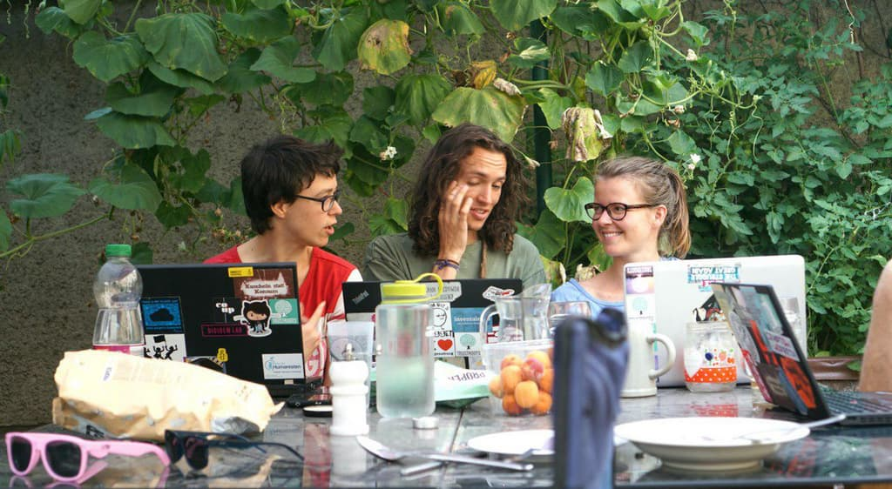
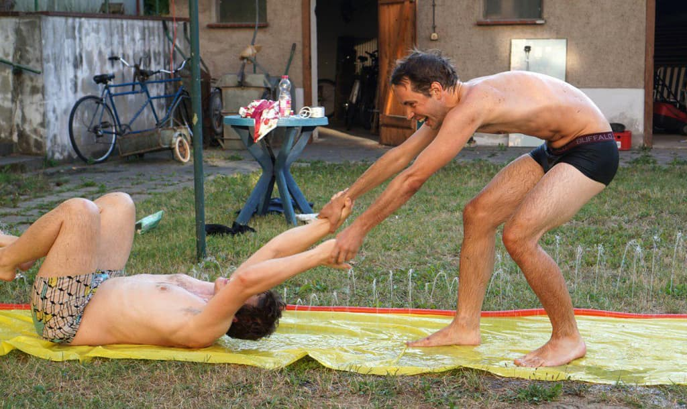
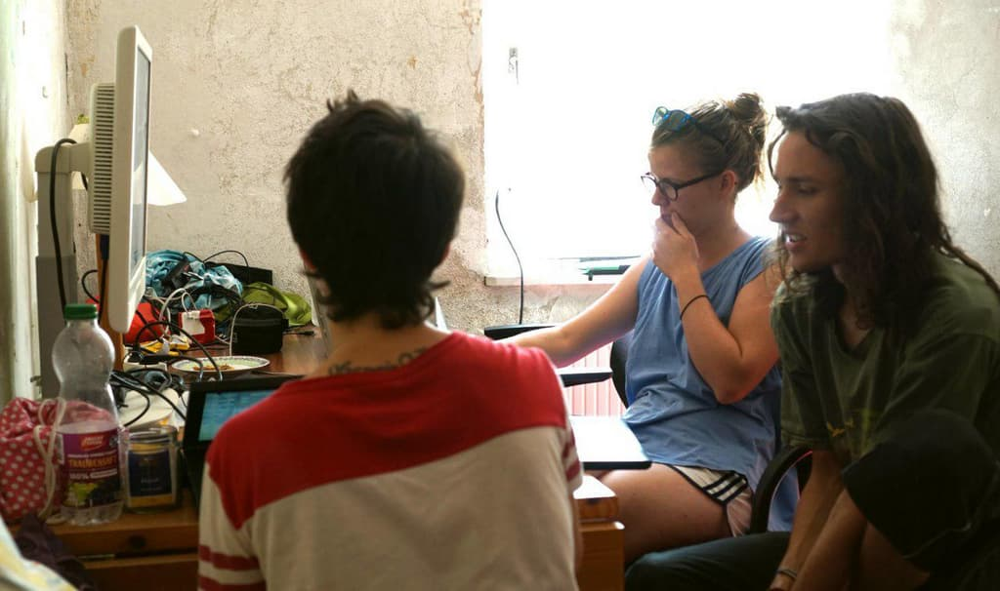

Genau vor einem Monat haben Tais und ich unseren _Summer of Karrot_ begonnen und vor ein paar Stunden wurde der Pull Request an dem wir gearbeitet haben gemerged!

Also was bedeutet das alles? Es bedeutet, dass wir riesige Schritte vorwärts gemacht haben auf unserem Weg Programmieren zu lernen! :D

===

Letztes Jahr haben wir den Plan gemacht beim [Rails Girls Summer of Code](https://github.com/yunity/karrot-frontend) mitzumachen, der Frauen hilft im Rahmen von Open-Source-Projekten in die Programmierung einzusteigen. Uns war von Anfang an klar, dass das einzige Projekt an dem wir arbeiten wollen [Karrot](https://github.com/yunity/karrot-frontend) ist, denn wir waren beide darin involviert bevor es überhaupt konkrete Formen angenommen hat und Tilmann und Nick sind die Hauptprogrammierer des Projektes.

Wir wurden nicht ausgewählt für das Rails-Girls-Ding, aber wir hatten Monate Zeit, um Vorfreude und Grundwissen aufzubauen, die wir dann in unserer Zeit des fokussierten Lernens anwenden wollten. Aus diesem Grund entschieden wir ohne groß zu überlegen, dass wir uns diese Zeit einfach trotzdem nehmen: Nick und Tais kamen zu Tilmann und mir ins Kanthaus und einen ganzen Monat lang widmeten wir all unsere Zeit und Energie dem Karrot-Projekt!

Zwei Leher für zwei Schülerinnen zu haben klingt schon ziemlich gut, aber es wurde sogar noch besser: Chandi hat sich spontan gemeldet, um uns die absoluten Grundlagen zu vermitteln und hat uns als erstes auf _den_ Klassiker angesetzt, wenn man eine neue Programmiersprache lernt: Die Todo-Liste. Zwei Tage lang ließ er uns an einer jQuery-Todo-Liste arbeiten bevor wir uns [Vue.js](https://vuejs.org/) näherten - dem JavaScript Framework das für Karrot verwendet wird. Es war angenehm es anfangs ein bisschen ruhiger angehen zu lassen, erstmal ein bisschen mehr Klarheit im Umgang mit diversen Begriffen, Technologien und Abläufen zu bekommen, bevor wir mit dem Karrot-Code in einen riesigen Pool voller kaltem Wasser springen sollten.

_Chandi bringt uns jQuery näher_

Wir haben am neuen Group-Applications-Feature gearbeitet und haben mit einer langen Session darüber angefangen, wie das Feature eigentlich aussehen soll. Dies waren die Ergebnisse:
- in der GroupGallery (der Gruppenübersicht) kann ein neuer User einen 'apply'-Button klicken
- der User kommt dann auf eine neue Seite, wo von der Gruppe gesetzte Fragen beantwortet werden müssen (die ApplicationForm)
- die GroupEdit-Seite braucht ein neues Feld, in dem die Gruppe diese Fragen setzen kann
- falls keine Fragen gesetzt werden stellen wir default-Fragen zur Verfügung
- existierende Gruppenmitglieder werden per Mail über die neue Bewerbung benachrichtigt
- existierende Gruppenmitglieder werden per Banner auf der GroupWall über austehende Bewerbungen informiert
- wenn das Banner angeklickt wird, landet der bestehende User auf der neuen ApplicationList-Seite, die alle Bewerbungen anzeigt
- in der ApplicationList können bestehende Mitglieder ausstehende Bewerbungen annehmen oder ablehnen, sowie den ApplicationChat erreichen
- ganz oben zeigt der ApplicationChat die Fragen und Antworten aus der ApplicationForm an
- der ApplicationChat ist eine Unterhaltung zwischen dem Bewerber und allen existierenden Mitgliedern der Gruppe
- der Bewerber kann den ApplicationChat über die GroupGallery oder die Email-Benachrichtigung über die erfolgreiche Bewerbung erreichen
- der Bewerber kann die Bewerbung in der GroupGallery auch zurückziehen
- Gruppen mit austehenden Bewerbungen werden für den Bewerber in der GroupGallery anders dargestellt

Wie ihr seht ist das ein ziemlich großes Feature und keiner von uns hat wirklich damit gerechnet es am Ende des Monats komplett implementiert zu sehen. Und seien wir mal ehrlich: Das ist es auch nicht. Davon abgesehen, dass das Backend sowieso von Tilmann geschrieben wurde, weil wir uns aufs Frontend konzentrieren wollten, haben wir den ApplicationChat für den ersten Merge vollkommen außen vor gelassen. Das beduetet, dass ein integraler Bestandteil des Features noch fehlt. Andererseits funktioniert es auch ohne den Chat und wir werden es ja nicht auf diesem Level an die User weiterleiten - es ist jetzt bloß [in unserer Beta-Version](https://dev.karrot.world) deployed, sodass andere Leute sich das schonmal anschauen und es austesten können.

_Tilmann und Nick machen eine wohlverdiente Pause_

Es gibt viele Online-Kurse, die Coding lehren; viele Anleitungen und Beschreibungen für Sprach-Features und Bibliotheken, aber für sich genommen kann nichts davon dich auf die Arbeit mit einer echten Codebase vorbereiten, die ihre eigenen Strukturen, inhärenten Logiken und internen Abhängigkeiten aufweist. Die erste Woche, in der wir wirkliches Karrot-Development machten, war eine sehr emotional aufgeladene Zeit. In einem Moment fühlten wir uns dumm, inkompetent und völlig verloren, und im nächsten waren wir ungeheuer stolz darauf etwas ohne Hilfe herausgefunden zu haben. Es gab einfach so viel Input und soviel Dinge mussten gleichzeitig im Kopf behalten werden! Die Syntax richtig hinkriegen, wissen wie die Daten fließen, ein Verständnis davon haben welche Zeichenfolge zu welcher Schicht des Codes gehört - was JavaScript, was Vue und was von Karrot selbst kommt - ein Gefühl dafür entwickeln was gerade wichtig ist und was ignoriert werden kann, sich nicht verwirren lassen davon dieselben Namen in verschiedenen Kontexten für ähnliche Dinge zu lesen, die dann aber doch _nicht genau_ dasselbe sind... >.<

Die Wellen der Verwirrung brachen immer wieder über uns herein, aber wir haben unser Ziel nicht aus den Augen verloren, sind drangeblieben und wurden am Ende ausreichend gut darin Karrot's Codebase zu navigieren, all die hilfreichen Werkzeuge angemessen zu verwenden, mit der immer wiederkehrenden Frustration umzugehen und als Team zu arbeiten, sodass wir funktionierenden Code produzieren konnten. Die letzten zwei Wochen haben sich extrem produktiv angefühlt und wir haben viele Dinge ganz allein lösen können.

_Und wieder vor den Laptops_

Falls du auch Interesse daran haben solltest Programmieren zu lernen, helfen dir unsere Haupterkenntnisse vielleicht weiter:

- Auch die besten Devs wissen oft nicht, was gerade los ist - sie geben nur nicht auf bis sie es herausgefunden haben!
- Dinge online nachzugucken ist kein Schummeln - es ist grundlegender Teil von effektivem Coden!
- Debugging ist der wichtigste aller Skills - benutze die Konsolen mit all ihren Features!
- Coding ist ein Teamsport - es ist keine Schande jemanden um Hilfe zu bitten, wenn man nicht weiterkommt!

Für den Anfang sind die kostenlosen Onlinekurse wirklich gut - wir haben sie auch gemacht! Tais und ich waren vor Allem auf [Freecodecamp](http://freecodecamp.org/) und haben dort die Basics über HTML, CSS, jQuery und JavaScript gelernt. Falls es doch lieber auf Deutsch sein soll, hat CHIP [eine nette Übersicht](https://praxistipps.chip.de/kostenlos-online-programmieren-lernen_28831) über Möglichkeiten angelegt. Es kostet nichts, macht Spaß und man kann sehr leicht die Grundlagen des Webdevelopments erlernen. Ich kann nur empfehlen es mal zu versuchen! :)
