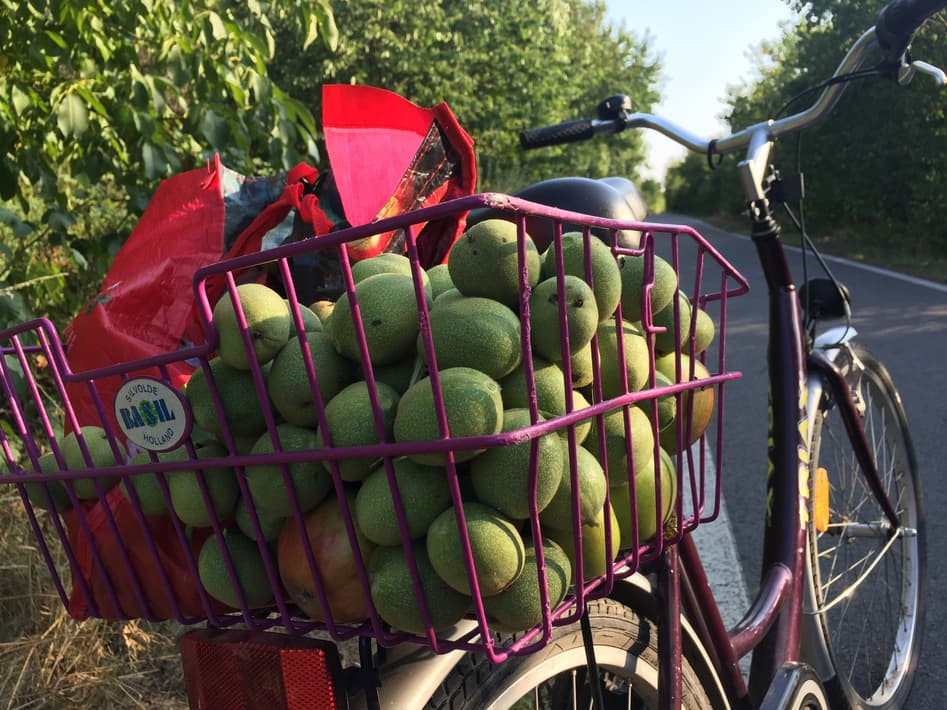
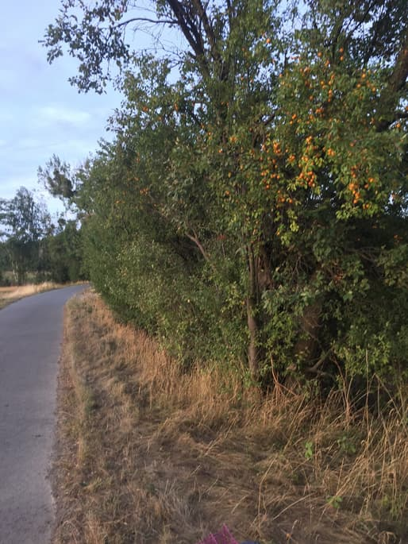
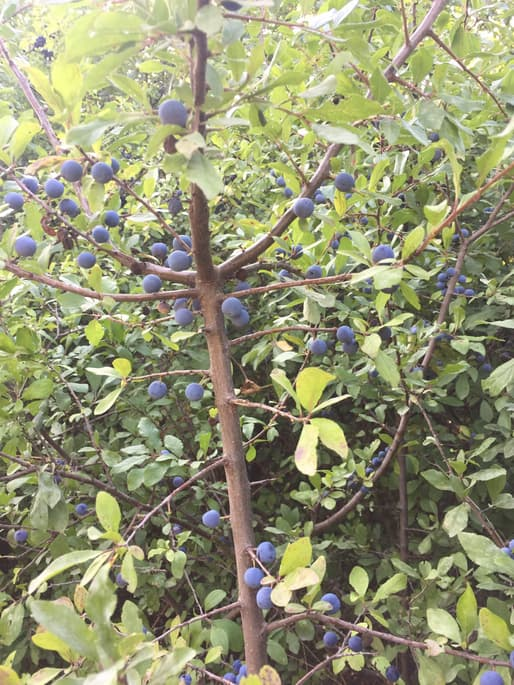

Wenn du jemals vom Kanthaus nach Lüptitz geradelt sein solltest, dann bist du wahrscheinlich über einen Radweg gefahren, an dem Unmengen von Obstbäumen stehen. In diesem Blogpost will ich erklären, was du dort für Essen finden kannst und wie es verarbeitet werden kann.

_Ein Fahrradkorb ist genug um grüne Walnüsse zu ernten_

### Zuerst eine (bestimmt lückenhafte) Liste der essbaren Früchte, die ich schon gefunden habe

- **Äpfel** – viele verschiedene Sorten mit verschiedenen Geschmäckern am Radweg. Normalerweise ab frührem August nach und nach reif. Ein Baum hat besonders viele, superleckere Früchte. Probiere einfach mehrere und finde selbst heraus, welche du am liebsten magst.
- **Birnen** – genauso und meist ein wenig später reif als Äpfel. Ich habe zwei Bäume gefunden, die besonders tolle Birnen tragen: Der erste ist am Weg von Lüptitz zum Kaolinsee, wenn du unter der Brücke an der Alten Hohburger Straße lang gehst. Ungefähr auf halber Strecke des Weges auf der rechten Seite solltest du ihn finden. Der andere ist an der Wurzener Straße ungefähr gegenüber der Einfahrt zum Quarzporphybruch. Viel Erfolg bei der Suche!
- **Pflaumen** – auch hier wieder viele verschiedene Arten, aber die kleinen gelben Mirabellen sind definitiv die süßesten und leckersten. Am selben Weg von Lüptitz zum Kaolinsee steht ein Baum auf der rechten Seite gegen Ende des Weges, kurz vor der Kurve. Ich habe ehrlich noch nie soviele Früchte an einem Baum gesehen.

  
_Der beeindruckende Mirabellenbaum wartet kurz vor der Kurve..._

- **Walnüsse** – Ich hab bis jetzt vier Bäume gezählt, allerdings sind sie ein wenig schwieriger zu finden. Wenn du noch nie Walnussbäume gesehen hast, dann halte dich an die Fotos. Es gibt definitiv einen Haufen an Nüssen und sie sind alle sehr einfach zu ernten.
- **Brombeeren und Himbeeren** säumen den Pfad. Himbeeren sind meist einen Monat früher reif als Brombeeren.
- **Pfirsiche** – Ich habe einen einzelnen Baum auf dem Weg von Wurzen nach Lüptitz gefunden, direkt an der Biegung des Radwegs. Ich bin mir allerdings nicht sicher wie reif oder essbar die Früchte sein werden.
- **Schlehen** – Viele Büsche überall am Weg.
- **Hagebutten** – finden sich auch überall.

  
_Schlehen am Baum_

### Ein paar Ideen um die Beute zu verwerten

- **Äpfel und Birnen** – Kompott, Marmelade, Chutney, Kuchen, einfach roh essen oder mithilfe des Dörrgerates im Kanthaus zu Chips und Ringen trocken
- **Pflaumen** – Kompott, Marmelade, Sauce, Kuchen, sauer einlegen oder einfach zum Snacken. The wilden Arten sind aromatischer und oftmals nicht so süß, was sie zu tollen Pickles oder Alkohol-Aromaten macht.
- **Walnüsse** – ab September können sie als Nüsse geerntet werden. Vorher (ab dem frühem Juni) können sie aber auch schon geerntet und dann sauer eingelegt werden. Der Zeitpunkt sollte früh genug sein, sodass sich die harte Schale in der grünen Walnuss noch nicht gebildet hat. Diese grünen Walnüsse können dann wunderbar und ohne viel Aufwand zu spannenden Pickles verarbeitet werden, bei denen man die gesamte Nuss verspeisen kann. [Hie ist ein original Englisches Rezept](https://www.thefield.co.uk/food/recipes/how-to-pickle-walnuts-22906).
- **Brombeeren und Himbeeren** – Marmelade, Gelee, Kompott, Kuchen, Aroma für Essig und Liköre.
- **Schlehen** – können als Zutat in Marmelade verwendet werden, aber so richtig zur Geltung kommen sie meiner Meinung nach als Aromat für Gin oder Wodka. Ich habe eine Flasche aufgesetzt, die jetzt im Keller des Kanthauses auf ihren Einsatz wartet. [Dies ist das Rezept, das ich benutzt habe](https://www.theguardian.com/lifeandstyle/2010/oct/10/nigel-slater-classic-sloe-gin-recipe).

  
_In der Weihnachtszeit wird er fertig sein!_

- **Hagebutten** – getrocknet werden sie zu einer wirklich guten Tee-Basis. Sirup und Gelee sind eine andere, sehr Vitamin C-haltige Möglichkeit, allerdings kann das ein bisschen Arbeit bedeuten, denn Hagebutten haben einen Menge Samen, die irgendwie herausgefiltert werden sollten.
