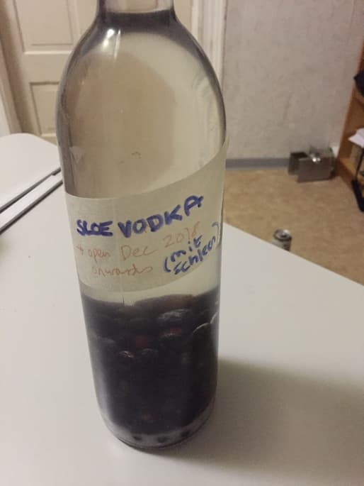

If you have ever cycled from Kanthaus to Lüptitz, you've probably been on a cycle path lined with a LOT of fruit trees.  This is a guide to explain what food there is to forage around the Wurzen/Lüptitz area, and how you might put it to use.

===

_A bike basket is enough to start foraging walnuts_

### First, a (probably incomplete) list of edible foods that I've found there already

- **Apples** – many different varieties on the cycle path with different flavours that will be ripe at slightly different times (usually from early August onwards). One tree in particular has a LOT of amazingly flavoured fruit.  Just try different ones and see what you like.
- **Pears** – the same, and usually ripe a little later than the apples. I have found two particular trees that have amazing flavour, which you should search for if you can! The first is on the path from Lüptitz to Kaolinsee (go under the bridge on Alte Hohburger Straße). It's around halfway down the path on the right. The other is on Wurzener Straße roughly opposite the road entrance to the Quarzporphybruch. Good luck finding them!
- **Plums** – again, many different varieties, but the mirabelles (small and yellow) have the best overall flavour and sweetness. The same path from Lüptitz to Kaolinsee has a tree on the right towards the end before the path starts curving to the right (see photos). I've never seen so many fruit on one tree.

  
_The amazing mirabelle tree is waiting just before the curve..._

- **Walnuts** – I have counted four trees so far, but more difficult to spot, if you've never seen one, so have a look at the photos. These have a lot of nuts and are really easy to harvest.
- **Blackberries and raspberries** both lining the path (raspberries usually ready one month before blackberries).
- **Peaches** – I've found a single tree on the road from Wurzen to Lüptitz, just before the cycle path turning. I'm not sure how ripe/edible these will be.
- **Sloes** – Lots of bushes along the path.
- **Dog rose and japanese rose** – again, these are everywhere.

  
_Sloes on a tree_

### Some ways you can use this food

- **Apples and pears** - compotes, jams, chutney, baking, eating fresh, or use the dehydrating machine in Kanthaus to make chips and rings
- **Plums** - compotes, jams, sauces, baking, pickling. Mirabelles are also great for snacking on.  As these wilder plum varieties are very flavourful, if not so sweet, they also make great pickles, or can flavour alcohol
- **Walnuts** – can be picked as nuts from from September onwards. However, you can also pick green walnuts in early June (before the shell forms around the nut). These make a fantastic pickle with minimal preparation, where you eat the whole nut, including the green outside part. [Here is a recipe](https://www.thefield.co.uk/food/recipes/how-to-pickle-walnuts-22906).
- **Blackberries & raspberries** – jams, jellies, compotes, baking, flavouring vinegars and alcohol
- **Sloes** – can be used as a jam ingredient, but they make fantastic flavoured gins and vodkas. There is a bottle I made waiting around in the Kanthaus basement with the other bottles of spirits (see photo). [Here's a recipe link](https://www.theguardian.com/lifeandstyle/2010/oct/10/nigel-slater-classic-sloe-gin-recipe)

  
_It will be ready around Christmas time!_

- **Rose hips** – you can dry these in the dehydrator to make a really good tea base. Also syrups and jellies are possible, which will contain a lot of Vitamin C, but can be a bit of work, as there are lot of seeds that need separating somehow.
