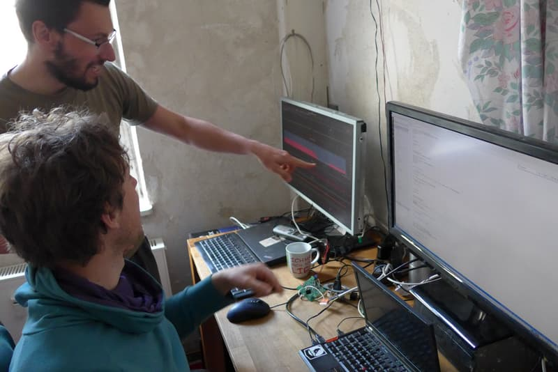
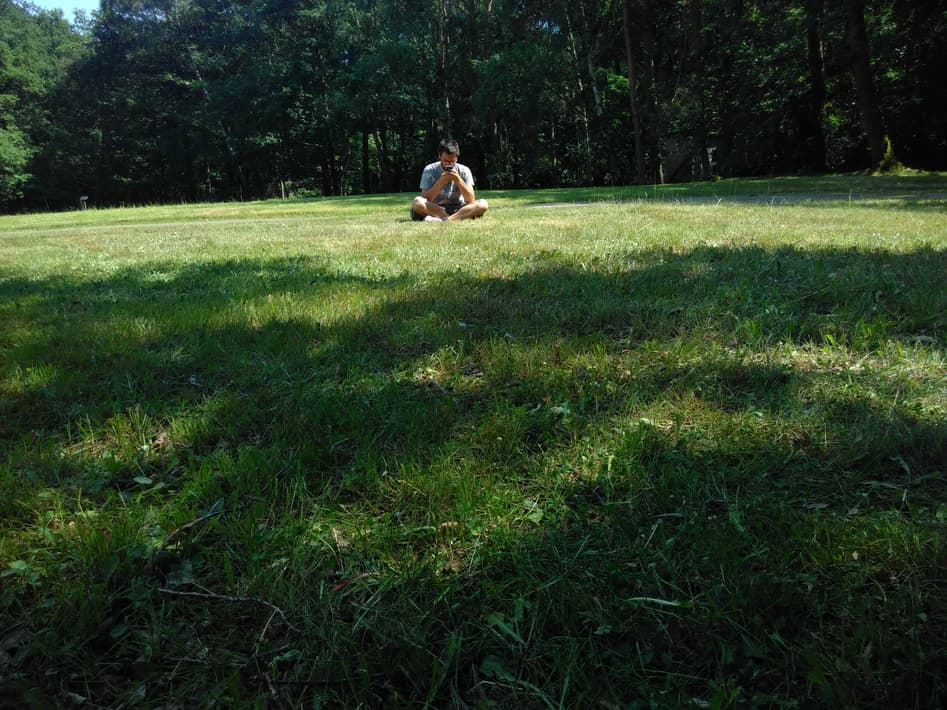

"Hör doch mal auf so viel zu _tun_, versuch mehr zu _sein_" und Ähnliches höre ich ziemlich oft. Ich bin jemand, der morgens früh aufsteht, den ganzen Tag mit verschiedensten Dingen beschäftigt ist, sich nicht so oft einfach mal "hinlegt und entspannt".

Wenn ich das Bedürfnis verspüre mich von Aufgabe A zu erholen, dann mache ich eben Aufgabe B. Wenn mir das wieder zu viel wird, dann fange ich vielleicht nochmal etwas ganz Neues an. Eventuell liegt dem ein Task Management Problem zugrunde, aber der grundsätzliche Ablauf macht mich froh.

===

Der Punkt ist: Ich mag wirklich gern, was ich tue.  
Ich bin intrinsisch motiviert Probleme zu suchen, zu finden, sie zu analysieren, über sie nachzudenken, Nachforschungen anzustellen und zu versuchen sie zu lösen.

Ich bin glücklich, ruhig und werde meine Kopfschmerzen los, wenn ich eine erfüllende Aufgabe erledige.

"Aber kannst du nicht auch einfach mal aufhören?"  
Doch schon, das kann ich. Meistens führt es dazu, dass ich mich langweile.  
Ich fühle, wie ein starker Drang in mir aufsteigt. Wenn meine Gedanken loslegen und einen Fokus erzeugen, verliere ich mich oft so sehr in etwas, dass ich mich auf nichts anderes mehr konzentrieren kann. Es wäre sooo cool, wenn ich das so machen könnte, würde es wohl funktionieren? Wie fange ich am besten an? Ich will das jetzt machen!

Natürlich gibt es auch Situationen, in denen ich es genieße Zeit mit einer Person oder einer Gruppe von Menschen zu verbringen, ohne irgendwas zu machen. Es kann sogar eine ziemlich intensive Zeit sein. Trotzdem fühlt sich das für mich an wie Ferien. Und ich kann nicht wochenlang Ferien machen. Da würde ich die Zeit lieber nutzen, um eins der Tausend Dinge in meinem Kopf weiter zu entwicklen - oder Ding 1001 anzufangen.
For sure, I might also be in situations where I enjoy spending time with a person or a group of people

Das bedeutet nicht, dass ich nicht auch mal Zeit brauche, um Gedanken, Gefühle und Sinn zu reflektieren. Für mich klappt das am besten bei einer simplen, repetitiven Aufgabe.

Abwaschen, den Rasen mähen, Tee kochen, den Boden wischen, in einem Meeting sitzen, das mich nicht interessiert - das sind gute Möglichkeiten für mich, um nachzudenken. Das gibt mir Energie und einen Überblick darüber, was gerade bei mir los ist: Was will ich eigentlich? Was fehlt mir?

Meditieren, mit einer Gruppe zusammensitzen, irgendwo mit einem Büchlein sitzen - nicht, dass das garnicht für mich funktioniert, aber es ist anstrengend. Es bringt mich vielleicht dazu, mich auf bestimmte Gefühle zu fokussieren, einige Details klarer zu bekommen, aber ich mache es nicht gern. Wenn du mich zu einer 2-Stunden-Session über sowas einlädst, schlafe ich danach vermutlich ein.

Immer wenn etwas in mir aufsteigt, dann will ich es dahingehend bearbeiten, dass ich etwas _tue_. 
- Ich habe das Gefühl, dass ich nicht die Veränderung in die Welt bringe, die ich sehen will? Okay, zurück an die Arbeit. Wenn das nicht klappt, vielleicht den Ansatz ändern.
- Zuviele Sachen in meinem Kopf? Erst eine Liste machen, dann oben anfangen sie abzuarbeiten. Währenddessen jedes Mal zufrieden sein, wenn ein Punkt abgehakt wird.
- Traurig über Dinge, die ich nicht ändern kann? Eine Aufgabe suchen. Entweder eine simple, bei der die Gefühle tiefer erforscht werden können, oder etwas, das meinen Kopf beschäftigt.

Vor zwei Wochen las ich [diesen Blog Post über die Balance zwischen Sein und Tun](../2018-08-16_balance-doing-being), der mich dazu inspirierte dies hier zu schreiben. Ich bin nicht zu 100% zufrieden mit der Art, wie ich meine Punkte formuliert habe, denn ich möchte verständlich rüberbringen, wie ich fühle, bin und tue.  
Dass es für mich richtig ist zu tun :-)  
Dass ich glücklich bin, auch wenn ich mich ein bisschen beschwere.  
Dass ich mein Leben grundsätzlich genieße, auch wenn es immer Raum für Veränderungen gibt.
