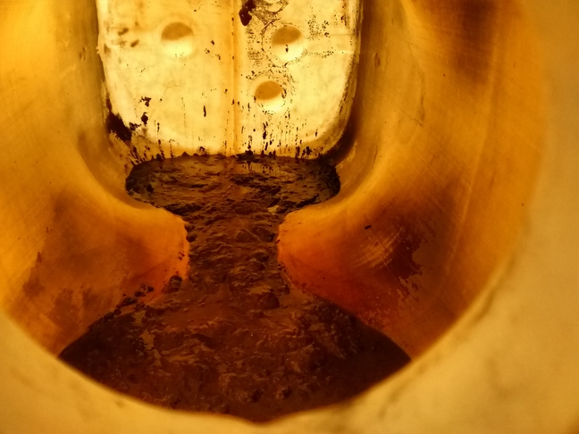

Wasser zu sparen, indem man leicht schmutziges Wasser zum Klospülen benutzt - klingt einleuchtend.
Von Januar 2018 bis Juni 2018 hatten wir im Kanthaus ein Grauwasser-Recycling-System Marke Eigenbau in Betrieb. Nach fast 6 Monaten und einigem an gespartem Wasser, haben wir uns trotzdem entschieden es außer Betrieb zu nehmen. Das System an sich war nicht schlecht - es gibt nur einige wichtige Kleinigkeiten, die im Auge behalten werden müssen. Die Gründe dafür es abzuschalten waren: häufiges Verstopfen der Toilettenspülkasten-Nachfüllventile und ein starker Gestank, der sich nach einigen Wochen einstellte.

===

Das war der Aufbau der ersten Version: Das Abwasser der Waschmachine fließt durch einen groben Filter in einen alten Öltank im Keller. Eine Pumpe befördert das Wasser in regelmäßigen Abständen in einen Puffer-Tank auf dem Dachboden, von wo die Toilettenspülkästen nach Bedarf befüllt werden. Das war recht einfach zu realisieren, da wir ungenutzte Rohre in den Wänden hatten, die sich perfekt dazu eigneten Grauwasser in zwei unserer meistgenutzten Toiletten zu transportieren. Den Puffer-Tank zu befüllen ist eine Aufgabe, die manuell ausgeführt wird: Eine Person geht in den Keller, macht die Pumpe an und wartet bis ein Sensor im Puffer-Tank anzeigt, dass dieser voll ist. Falls das Grauwasser im Keller alle sein sollte, füllt ein Kontrollsystem mit Magnetventil den Puffer-Tank mit Leitungswasser, sodass die Toiletten immer einsatzbereit sind.

Am Anfang roch das Wasser in den Toiletten nur ein kleines bisschen, aber nach ein paar Wochen verschlimmerte sich das drastisch. Wir fanden heraus, dass Waschmaschinen-Abwasser reich an Nährstoffen und arm an Sauerstoff ist. Das ist eine ideale Umgebung für anaerobe Bakterien, die stinkende Gase produzieren. In den Tanks im Keller, die niemals komplett geleert wurden, sammelte sich Schlamm, der das Auspumpen unmöglich machte.

 
_Vorrats-Tank nach 4 Monaten: Es sind nur Textilfasern in Wasser, aber es sieht aus und riecht wie Scheiße._

 
_Die Pumpe, mit der wir das Grauwasser in den Puffer-Tank brachten_

Wir hatten ein paar Ideen, um die Probleme zu lösen:

- Das Abwasser der Dusche nutzen, anstatt das der Waschmaschine (allerdings sind die Mengen deutlich geringer und in unserem Fall ist es schwerer zu sammeln)
- Luft in den Vorrats-Tank blasen, damit sich aerobe anstatt anaerober Bakterien bilden (das braucht aber viel Strom und das Wasser in den Rohren und im Puffer-Tank wird nach wie vor riechen)
- Nur das Wasser des zweiten und dritten Spülgangs der Waschmaschine sammeln, damit das Gros der Nährstoffe wegfällt (aber wie können wir wissen, in welcher Phase die Waschmachine gerade ist? Hier wäre mehr Recherche nötig...)
- Die Wassermenge im Puffer-Tank verringern, damit möglichst wenig Wasser durch die hohe Temperatur im Dachboden erhöhtem Bakterienwachstum ausgesetzt ist (dann müssten wir aber das Nachfüllen des Puffer-Tankes automatisieren)
- Den Vorrats-Tank im Keller regelmäßig komplett leeren, um soviele Bakterien wie möglich los zu werden

Die letzten zwei Punkte erschienen uns am wichtigsten für direkte Maßnahmen, also haben wir den Öltank durch einen [IBC](https://en.wikipedia.org/wiki/Intermediate_bulk_container) ersetzt, da diese leichter zu leeren sind, und haben einen Sensor eingebaut, der anzeigt, wenn der Tank leer ist. Außerdem haben wir die Leitungswasser-Nachfüllung in den Keller verlegt, sodass unser Kontrollsystem den Vorrats-Tank immer mal wieder mit frischem Wasser spülen kann. Nach ein bisschen Programmierung an unserem Kontrollsystem ([ein CAN-bus Heimnetzwerk mit STM](https://github.com/NerdyProjects/HouseBusNode)) war die zweite Version des Grauwasser-Systems einsatzbereit!

Kurz darauf stellten wir fest, dass die Toiletten manchmal kein Spülwasser hatten. Die Nachfüll-Ventile waren durch die größeren Stückchen im Grauwasser verstopft. Moderne Pilotventile haben sehr kleine Öffnungen und kommen mit Verschmutzungen nicht gut klar. Glücklicherweise hatten wir noch ein paar alte Toilettenventile mit größeren Öffnungen herumliegen. Das hat geholfen, aber nach einer Weile waren selbst die robusteren Ventile verstopft. Weiteres Rumgebastel, wie z.B. das Aufbohren der Ventil-Öffnungen, hatte ähnliche Effekte: Es half für eine kurze Zeit, dann funktionierten die Spülungen wieder nicht.

Die Kanthaus-Toiletten hatten inzwischen den Ruf aufgebaut unzuverlässig und übel riechend zu sein, und niemand war mehr motiviert am Grauwasser-System zu arbeiten. Innerhalb eines einzigen Abends legten wir das Grauwasser-System still und stellten die betroffenen Toiletten wieder auf Leitungswasser um.

Was lernen wir daraus? Mit Wasser zu arbeiten ist schwierig, es gibt immer irgendwo ein Leck und Tanks komplett zu leeren ist nicht einfach. Es gibt viele Ideen, wie das System verbessert werden kann, aber es braucht Zeit und Energie, um sie auszuprobieren. Für den Moment haben alle von uns entschieden unsere Zeit anderen Projekten zu widmen. Vielleicht bringt die Zukunft uns eine weitere Runde hausinternes Wasser-Recycling :)

 
_IBC-Tank, der in der zweiten Version als Vorrats-Tank diente. Die Pumpe unten ist standardmäßig mit Wasser gefüllt._

 
_Grauwasser-Puffer-Tank auf dem Dachboden_
