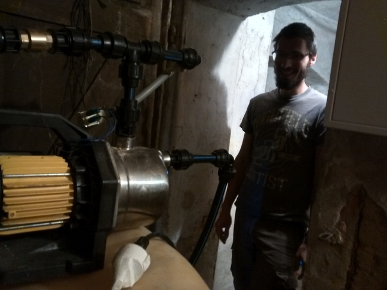
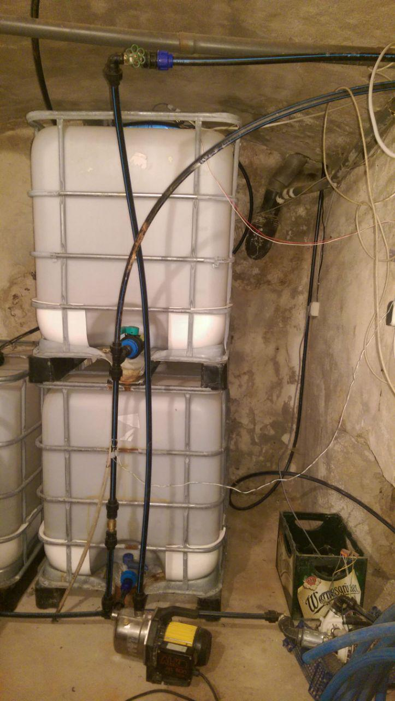
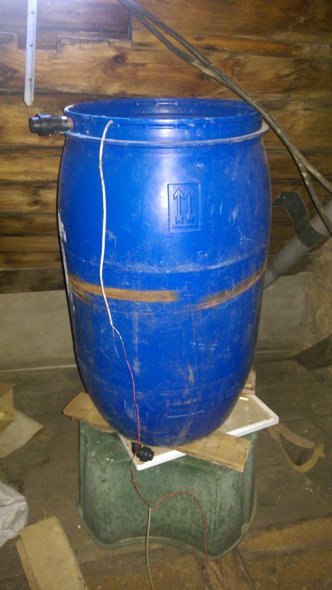

Saving water by reusing slightly dirty water for flushing toilets - seems a no-brainer.
At Kanthaus, we operated a DIY greywater recycling system for almost 6 months, from January 2018 to June 2018.
Even though the system did save us about 30% water, we decided to turn it off.
But it's not that the system was bad in general - there are just some important bits to watch out for.
The reasons why we turned it off were: frequent clogging of the toilet refill valves and a strong stench that developed after some weeks.

===

Here's the setup of the first version: the waste water from the washing machine flows through a coarse filter into a old oil tank in the basement.
A pump periodically moves the water into a buffer tank in the attic, from where it refills the toilet tanks as needed.
This was quite easily done, as we had unused pipes in the wall that were perfectly suited to get greywater into two of our most used toilets.
Refilling the buffer is a manual task - one person goes into the basement, turns on the pump and waits until a sensor at the buffer tank shows "full".
If our greywater reserves in the basement are depleted, a control system with a solenoid valve fills tap water into the buffer tank, to keep the toilets always operational.

In the beginning, the water in the toilets was only a little bit smelly, but it got worse after some weeks.
We found out that washing machine waste water is rich in nutrients and low in oxygen.
This is an ideal environment for the growth of anaerobic bacteria, which like to produce smelly gas.
As we did never empty the tank in the basement completely, sludge did accumulate at the bottom, making it impossible to pump it out.

 
_Reserve tank, 4 months in: it's only pieces of clothing in water, but it looks and smells like shit._

 
_The jet pump that we used to move greywater to the buffer tank_

We had some ideas how to solve this:

- use waste water from shower instead of the washing machine (but it's way less water and in our case it's harder to collect)
- blow air into the greywater reserve to get aerobic instead of anaerobic bacteria (but it's much electric energy need and there's still water in the pipes and the buffer that will start smelling)
- only reuse water from the second and third rinsing cycle of the washing machine, to avoid most of the nutrients (but how to know in which cycle the washing machine is in? Needs some detailed analysis...)
- minimize the amount of water in the buffer tank, as the warm temperatures in the attic will speed up bacterial growth (but then we need to automate the "refill buffer" step for sure)
- regularly empty the basement tank, to get rid of as much bacteria as possible

We identified the last two points as most important action points, so we replaced the oil tank with an [IBC](https://en.wikipedia.org/wiki/Intermediate_bulk_container) as they are easier to empty and built a sensor to detect when reserved are depleted.
We also moved the tap water refill to the basement, so our control system could periodically rinse the basement tank with fresh water.
After some programming of our control system (a [CAN-bus home network with STM microprocessors](https://github.com/NerdyProjects/HouseBusNode)), the second version of the greywater system was operational!

Soon after, we noticed that sometimes toilets were out of water.
The refill valves have been clogged by more solid material inside the grey water.
As modern [pilot valves](https://en.wikipedia.org/wiki/Pilot_valve) have very small openings, they do not tolerate dirt very much.
Luckily, we had some old toilet valves around that had bigger openings.
This helped us, but alas - even the more robust valves clogged after a while.
Some follow-up tinkering that involved widening the openings of the valve had similar effects.
It only solved the problem for a short time, until toilets stopped working again.

At this point in time, toilets in Kanthaus already developed an internal reputation of being unreliable and smelly, and nobody was motivated to work on the greywater recycling system anymore.
In the course of one evening, we disabled the greywater collection and switched the affected toilets over to tap water.

What did we learn from this? Dealing with water is hard, there's always a leak somewhere and it's hard to empty tanks completely.
There's many ideas how to improve the system, but it takes time and energy to try them out.
For now, all of us decided to invest our time in other projects.
But maybe the future will bring us another round of in-house water recycling :)

 
_IBC tank that was use as reserve for the second version. The pump on bottom is filled with water by default._

 
_Greywater buffer on the attic_
